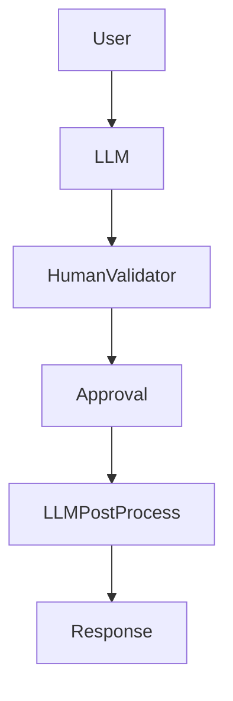
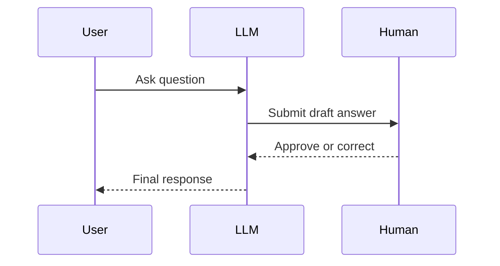
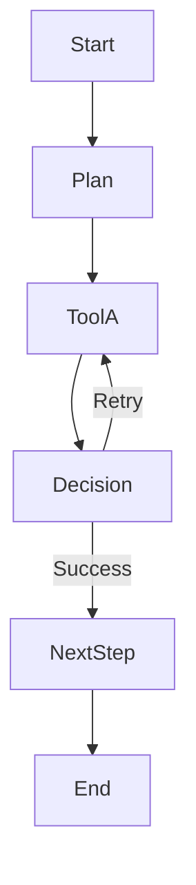
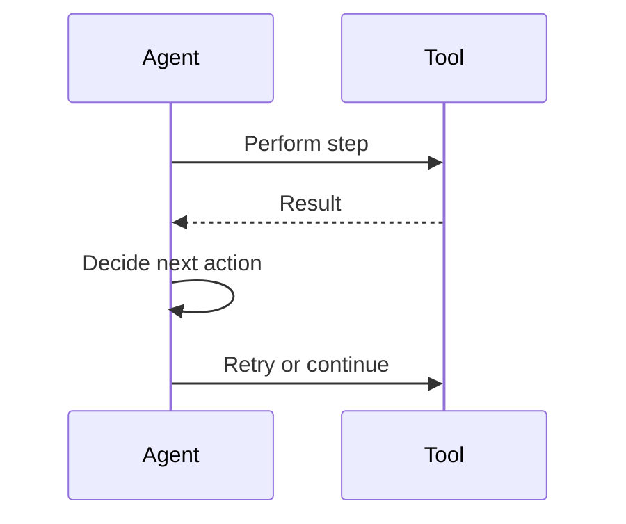
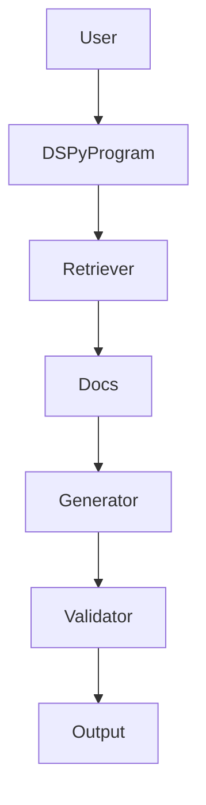
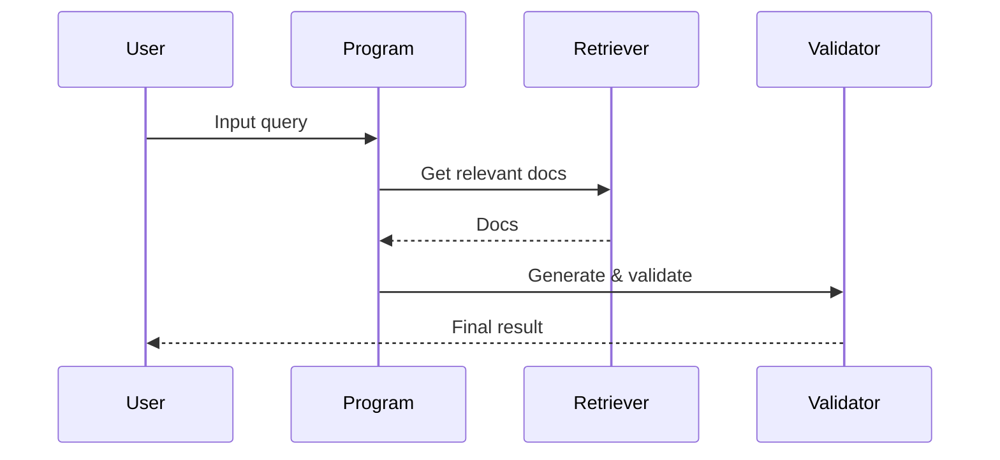
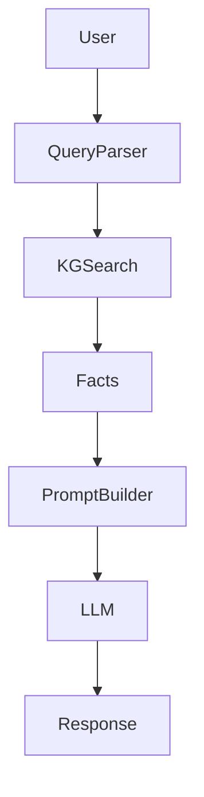
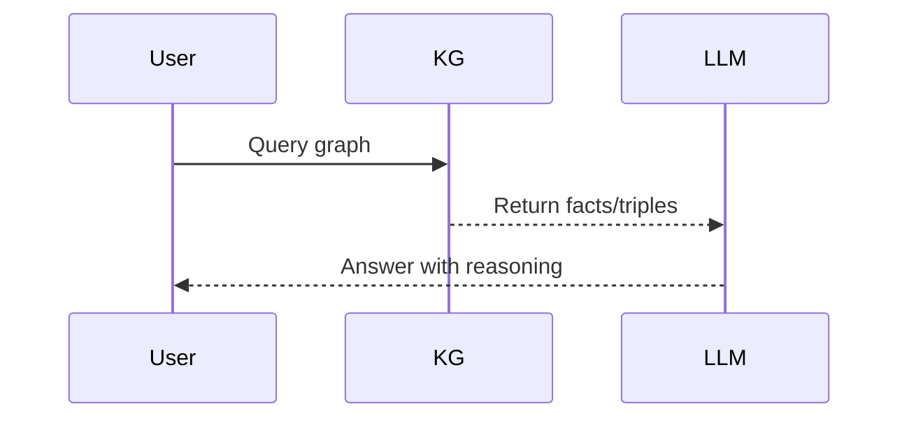

# Context-Augmentation, Prompt Engineering, and Tool-Calling Pipelines

A comprehensive overview of common pipeline architectures used to extend LLM capabilities with external data, memory, tools, and structured context.

---

...[previous content remains unchanged]...

---

## 👥 10. Human-in-the-Loop Pipeline

**Description:** Incorporates human validation or intervention in the augmentation or generation process.

**Tools:** Label Studio, Trulens, Guardrails, Streamlit, Feedback APIs  
**Use Case:** Legal assistant with human review for risk-sensitive advice.

### Architecture Diagram

### Flow Diagram

---

## 🔀 11. LangGraph State Machine Pipeline

**Description:** Uses LangGraph to orchestrate complex stateful agent workflows with branching logic and memory.

**Tools:** LangGraph, LangChain agents, LangSmith, vector stores  
**Use Case:** Multi-step task agent with retries, planning, and memory.

### Architecture Diagram

### Flow Diagram

---

## 🧪 12. DSPy Compiler Pipeline

**Description:** Compiler-based approach that tunes declarative LLM programs using search, validation, and constraints.

**Tools:** DSPy, ColBERTv2, OpenAI, DeepEval  
**Use Case:** Query answering pipeline that self-improves with training data.

### Architecture Diagram

### Flow Diagram

---

## 🕸️ 13. Knowledge Graph-Augmented Pipeline

**Description:** Inject facts and relationships from a knowledge graph to enhance reasoning and accuracy.

**Tools:** Neo4j, LlamaIndex KG retriever, RDF/SPARQL, LangChain  
**Use Case:** Medical assistant reasoning over symptoms and treatments.

### Architecture Diagram

### Flow Diagram

