# Context-Augmentation, Prompt Engineering, and Tool-Calling Pipelines

A comprehensive overview of common pipeline architectures used to extend LLM capabilities with external data, memory, tools, and structured context.

---

## 🧱 1. Retrieval-Augmented Generation (RAG)

**Description:** Retrieve relevant documents from a vector database and inject them into the prompt.

**Tools:** LangChain, LlamaIndex, Haystack, Weaviate, Pinecone  
**Use Case:** Answering questions using company documentation.

### Architecture Diagram

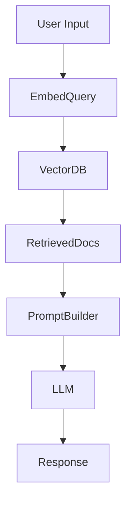

### Flow Diagram

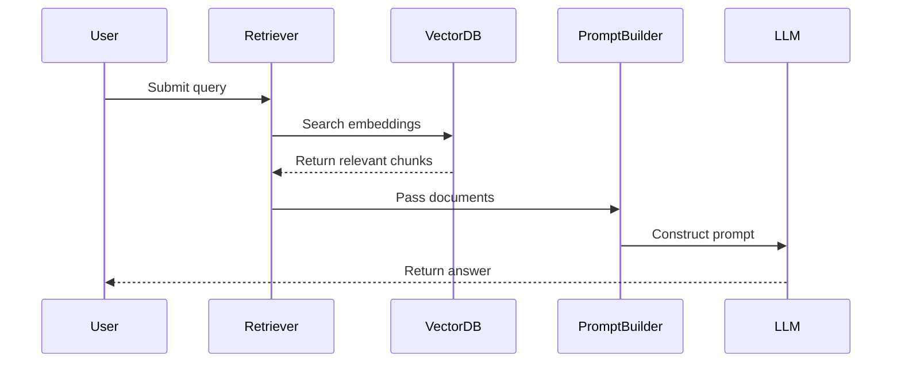

---

## 🧠 2. Cached-Augmented Generation (CAG)

**Description:** Retrieve previously computed answers or summaries to speed up response time and avoid recomputation.

**Tools:** Redis, LlamaIndex, local caches  
**Use Case:** Frequently asked support questions.

### Architecture Diagram

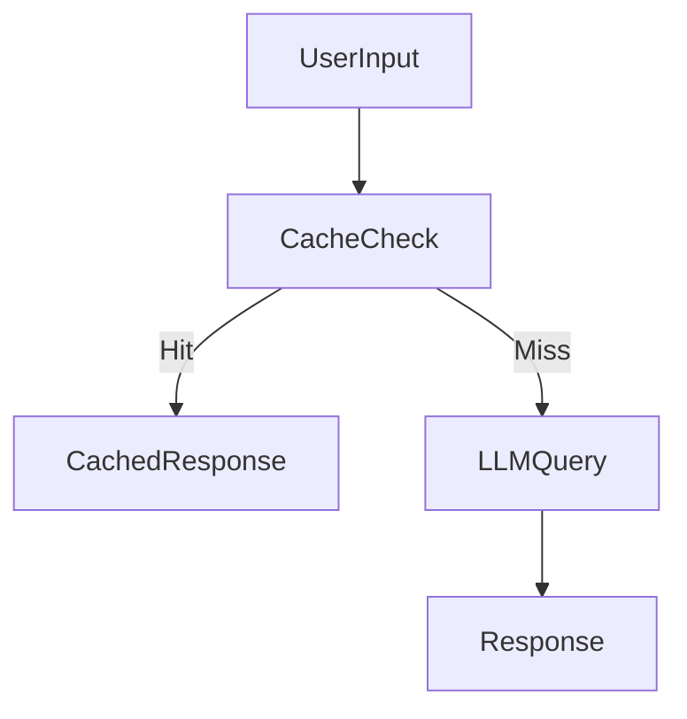

### Flow Diagram

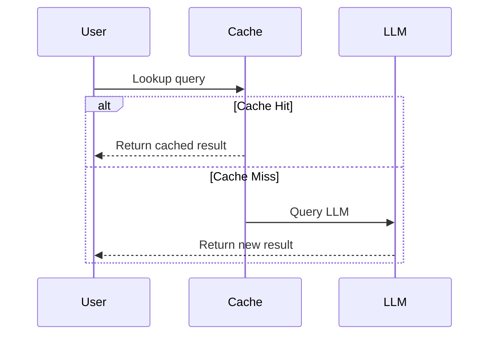

---

## 🤖 3. Tool-Augmented Pipeline

**Description:** Inject tool calls into generation flow (calculator, search, API, etc.).

**Tools:** LangChain tools, ReAct, Toolformer, OpenAI functions, Vercel AI SDK  
**Use Case:** Travel planner that looks up flights and weather.

### Architecture Diagram

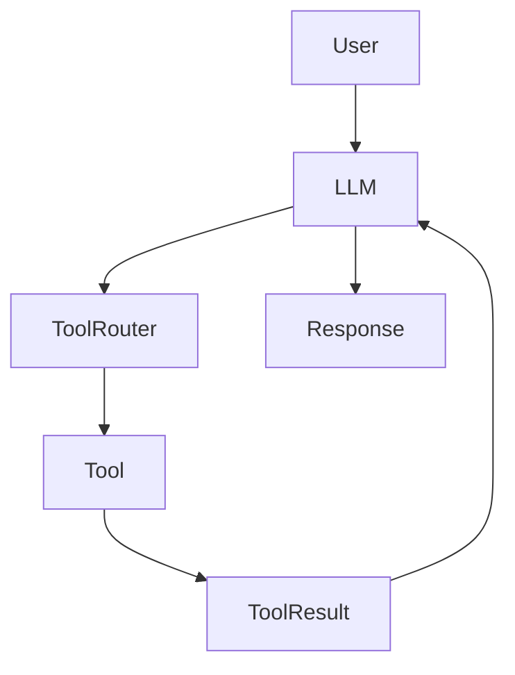

### Flow Diagram

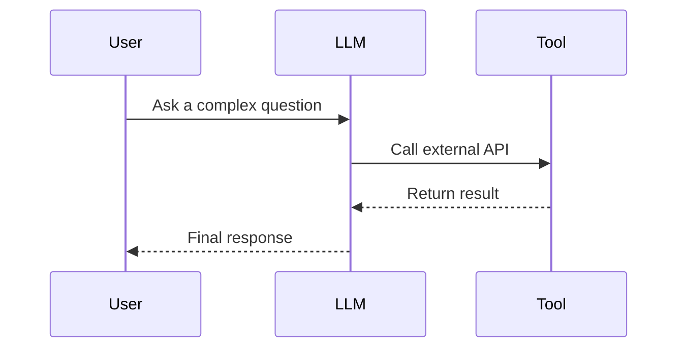

---

## 🧵 4. Memory-Augmented Pipeline

**Description:** Augments LLM with long-term or short-term memory from past interactions.

**Tools:** LangChain memory, vector DBs, semantic caching  
**Use Case:** Personal AI assistant that remembers your preferences.

### Architecture Diagram

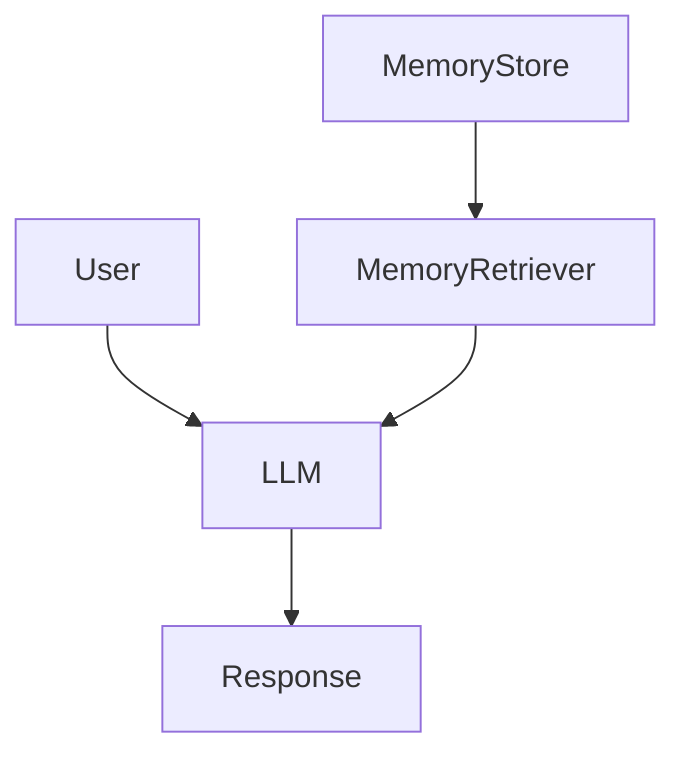

### Flow Diagram

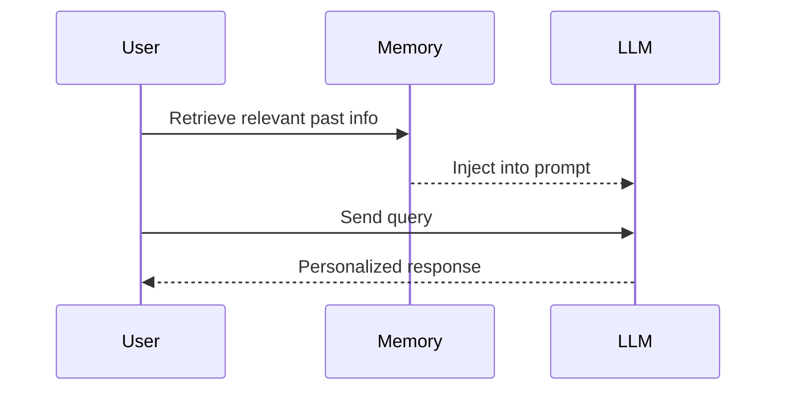

---

## 🧭 5. Agentic Pipeline

**Description:** The LLM acts as an agent that plans, acts, and reflects using tools and memory.

**Tools:** LangGraph, AutoGPT, CrewAI, LangChain agents  
**Use Case:** AI researcher that iteratively finds and summarizes papers.

### Architecture Diagram

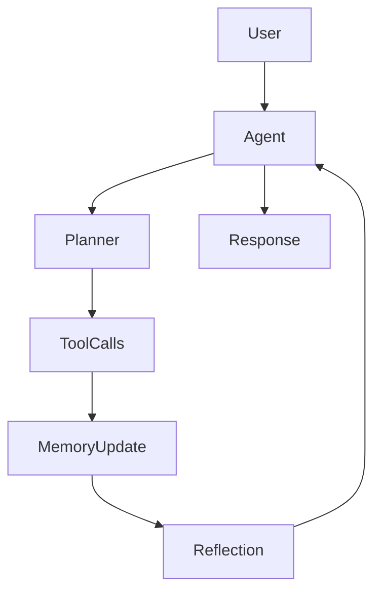

### Flow Diagram

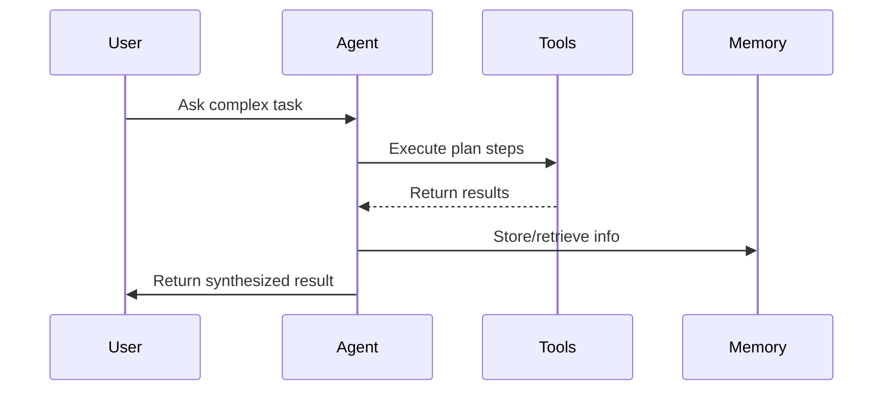

---

## 🧩 6. Programmatic Prompt Construction Pipeline

**Description:** Dynamically assembles prompts using templates, business rules, or application state.

**Tools:** LangChain, PromptLayer, DSPy, custom code  
**Use Case:** Customer support bot with form-driven answers.

### Architecture Diagram

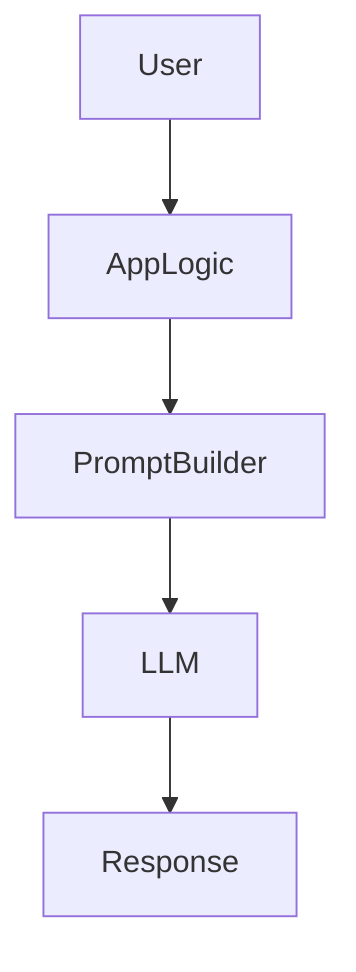

### Flow Diagram

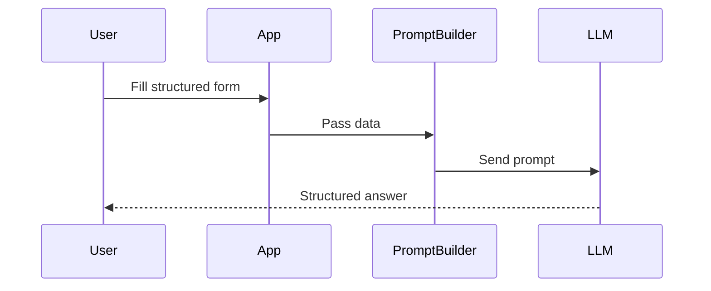

---

## 🧮 7. Schema-Linked Pipeline

**Description:** Model understands structured schema (SQL, JSON, APIs) and generates code or queries accordingly.

**Tools:** LangChain SQL agent, DSPy structured I/O, OpenAI function calling  
**Use Case:** BI assistant querying a Postgres database.

### Architecture Diagram

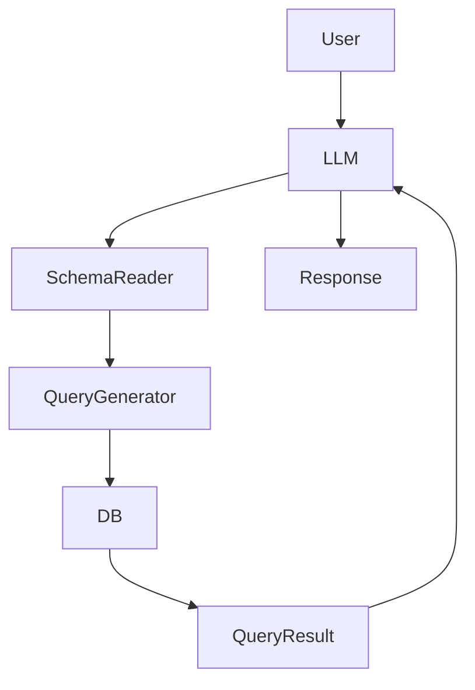

### Flow Diagram

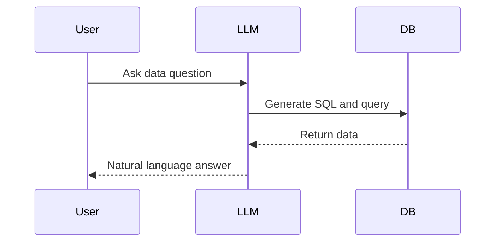

---

## 👥 10. Human-in-the-Loop Pipeline

**Description:** Incorporates human validation or intervention in the augmentation or generation process.

**Tools:** Label Studio, Trulens, Guardrails, Streamlit, Feedback APIs  
**Use Case:** Legal assistant with human review for risk-sensitive advice.

### Architecture Diagram

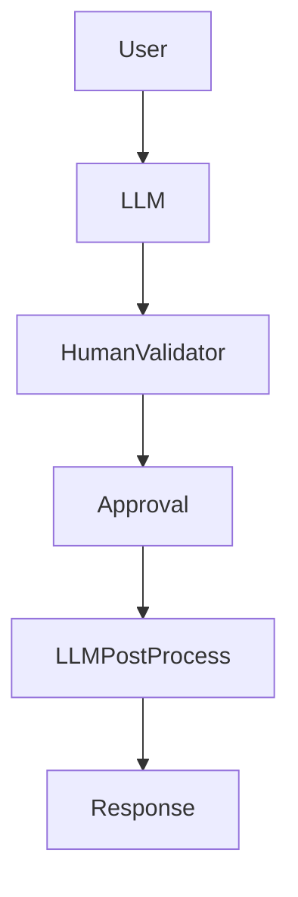

### Flow Diagram

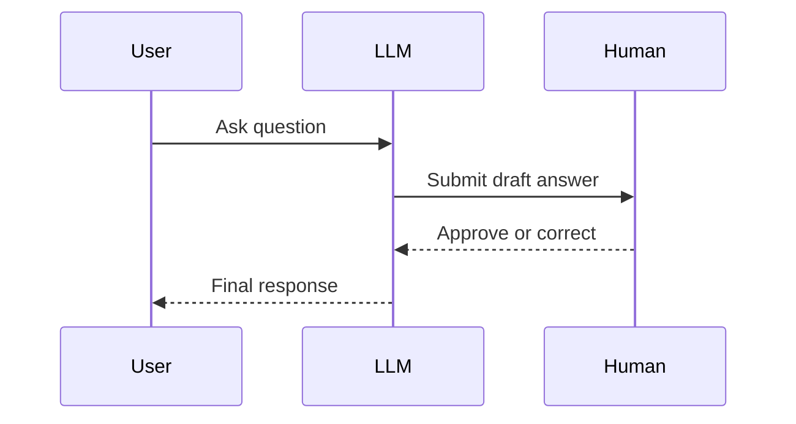

---

## 🔀 11. LangGraph State Machine Pipeline

**Description:** Uses LangGraph to orchestrate complex stateful agent workflows with branching logic and memory.

**Tools:** LangGraph, LangChain agents, LangSmith, vector stores  
**Use Case:** Multi-step task agent with retries, planning, and memory.

### Architecture Diagram

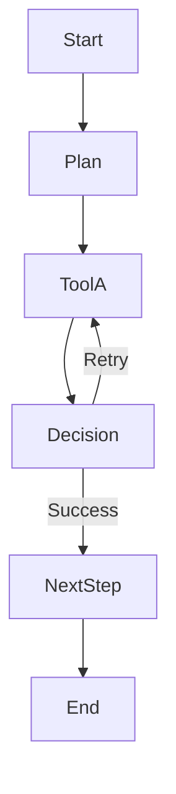

### Flow Diagram

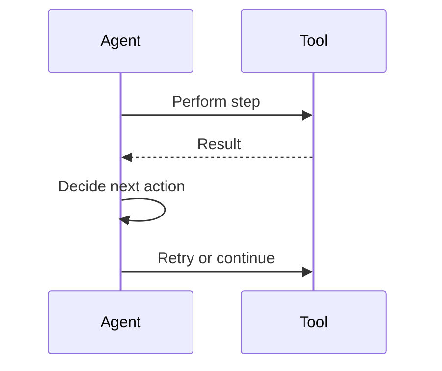

---

## 🧪 12. DSPy Compiler Pipeline

**Description:** Compiler-based approach that tunes declarative LLM programs using search, validation, and constraints.

**Tools:** DSPy, ColBERTv2, OpenAI, DeepEval  
**Use Case:** Query answering pipeline that self-improves with training data.

### Architecture Diagram

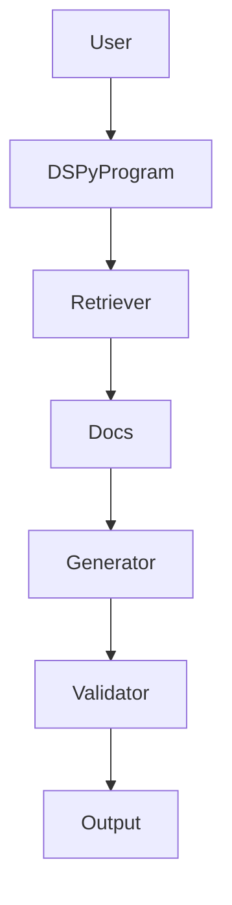

### Flow Diagram
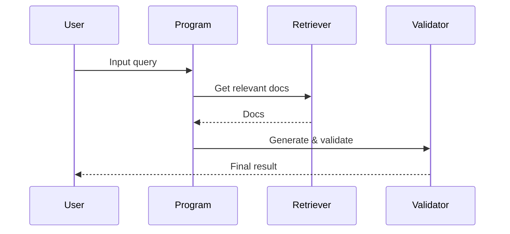

---

## 🕸️ 13. Knowledge Graph-Augmented Pipeline

**Description:** Inject facts and relationships from a knowledge graph to enhance reasoning and accuracy.

**Tools:** Neo4j, LlamaIndex KG retriever, RDF/SPARQL, LangChain  
**Use Case:** Medical assistant reasoning over symptoms and treatments.

### Architecture Diagram

```mermaid
graph TD
    User --> QueryParser
    QueryParser --> KGSearch
    KGSearch --> Facts
    Facts --> PromptBuilder
    PromptBuilder --> LLM
    LLM --> Response
```

### Flow Diagram

```mermaid
sequenceDiagram
    participant User
    participant KG
    participant LLM

    User->>KG: Query graph
    KG-->>LLM: Return facts/triples
    LLM-->>User: Answer with reasoning
```

---

## Tool Calling and Action Execution Pipelines for LLMs

---

### 1. **MCP-Based Command Pipeline**

**Description:**
The Model Context Protocol (MCP) enables structured interaction with LLMs by coordinating UI context, user actions, and tool calls.

**Tools:**
- LLM (OpenAI/GPT, Claude, etc.)
- MCP runtime (Cursor IDE, SDK)
- User interface (IDE, Web, CLI)

**Use Case:**
AI-enhanced developer experience where the LLM understands the editing context, proposes code, and invokes tools via MCP.

**Architecture Diagram:**

```mermaid
flowchart TD
    UI[User Interface] --> MCP[MCP Runtime]
    MCP --> Context[Context Collector]
    MCP --> LLM[LLM]
    MCP --> Tools[Tooling APIs]
    LLM -->|Request Tool| Tools
    Tools -->|Tool Output| LLM
    LLM --> MCP
    MCP --> UI
```

**Flow Diagram:**

```mermaid
sequenceDiagram
    participant User
    participant UI
    participant MCP
    participant LLM
    participant Tools

    User->>UI: Makes request (e.g., "Refactor this")
    UI->>MCP: Sends UI context + intent
    MCP->>LLM: Provides context and query
    LLM->>Tools: Triggers tool invocation (e.g., refactor)
    Tools-->>LLM: Returns results
    LLM->>MCP: Structured output
    MCP->>UI: Updates editor with results
```

---

### 2. **Function Calling / OpenAI Tools Pattern**

**Description:**
An LLM is given access to structured functions (with schema), which it can invoke during conversation to perform actions.

**Tools:**
- LLM with function calling capability (OpenAI GPT-4, Anthropic)
- Backend API or toolkit (calculator, DB, calendar, etc.)

**Use Case:**
AI assistant that can book events, retrieve real-time data, or perform tasks.

**Architecture Diagram:**

```mermaid
flowchart TD
    User --> LLM
    LLM -->|Schema Introspection| Functions
    LLM -->|Tool Call| Functions
    Functions --> LLM
    LLM --> User
```

**Flow Diagram:**

```mermaid
sequenceDiagram
    participant User
    participant LLM
    participant Functions

    User->>LLM: "What's the weather in Tokyo?"
    LLM->>Functions: Call getWeather({city: "Tokyo"})
    Functions-->>LLM: { temp: 27, condition: "Clear" }
    LLM-->>User: "It’s 27°C and clear in Tokyo."
```

---

### 3. **Agentic Planning with Tool Execution**

**Description:**
LLM acts as a planning agent that decides which tools to use and in what sequence to solve complex tasks.

**Tools:**
- LLM (GPT-4, Claude)
- Agent Planner module
- Tool Execution Layer

**Use Case:**
Multi-step task like "Plan my weekend trip," involving search, scheduling, booking.

**Architecture Diagram:**

```mermaid
flowchart TD
    User --> Planner[Agent Planner]
    Planner --> LLM[LLM]
    Planner --> ToolSelector[Tool Selector]
    ToolSelector --> Tools[Toolset / APIs]
    Tools --> LLM
    LLM --> Planner
    Planner --> User
```

**Flow Diagram:**

```mermaid
sequenceDiagram
    participant User
    participant Planner
    participant LLM
    participant Tools

    User->>Planner: "Plan my weekend trip"
    Planner->>LLM: Generate plan steps
    LLM-->>Planner: {steps}
    Planner->>Tools: Invoke tools for each step
    Tools-->>Planner: Return results
    Planner->>User: Combined answer
```

---

### 4. **Autonomous Looping Agent (AutoGPT-like)**

**Description:**
LLM agents autonomously create and execute plans, use tools, evaluate outcomes, and iterate until a goal is achieved.

**Tools:**
- LLM (with long-term memory)
- Execution Environment
- Scratchpad / Task memory
- Tool APIs

**Use Case:**
"Research market trends and write a summary report"

**Architecture Diagram:**

```mermaid
flowchart TD
    Goal[User Goal] --> AgentLoop[Agent Runtime Loop]
    AgentLoop --> Plan[Planner LLM]
    AgentLoop --> Tools[Tool Executor]
    Tools --> Scratchpad
    AgentLoop --> Evaluator[Evaluator LLM]
    Evaluator --> AgentLoop
    AgentLoop --> Output[Final Result]
```

**Flow Diagram:**

```mermaid
sequenceDiagram
    participant User
    participant Agent
    participant Tools
    participant Memory

    User->>Agent: Define goal
    loop Until Goal Achieved
        Agent->>Tools: Use tool for subtask
        Tools-->>Memory: Store result
        Agent->>Agent: Reflect and replan
    end
    Agent->>User: Final result
```

---

### 5. **Hybrid Vector-Symbolic Tool Routing**

**Description:**
LLM chooses between vector retrieval and symbolic (structured) tools depending on query intent.

**Tools:**
- LLM
- VectorDB
- SQL engine / keyword search
- Router or selector agent

**Use Case:**
A helpdesk assistant that uses semantic search for questions but switches to SQL for metrics queries.

**Architecture Diagram:**

```mermaid
flowchart TD
    User --> Classifier[Intent Classifier]
    Classifier -->|Semantic| Embedder --> VectorDB --> LLM
    Classifier -->|Structured| SQLGen --> SQLDB --> LLM
    LLM --> User
```

**Flow Diagram:**

```mermaid
sequenceDiagram
    participant User
    participant Classifier
    participant VectorDB
    participant SQLDB
    participant LLM

    User->>Classifier: Ask question
    alt Semantic
        Classifier->>VectorDB: Search
        VectorDB-->>LLM: Docs
    else Structured
        Classifier->>SQLDB: Run query
        SQLDB-->>LLM: Rows
    end
    LLM->>User: Answer
```

---

### 6. **LLM-to-SQL Natural Language Querying**

**Description:**
LLM parses a natural query into SQL, executes it on a database, and returns a structured or natural language response.

**Tools:**
- LLM (fine-tuned or prompted for SQL)
- SQL engine (PostgreSQL, SQLite, etc.)
- Schema introspection tools

**Use Case:**
Business dashboard with AI assistant that answers questions like "Top customers last month."

**Architecture Diagram:**

```mermaid
flowchart TD
    User --> LLM
    LLM --> SQLGen[SQL Generator]
    SQLGen --> DB[Database]
    DB --> Result[Query Results]
    Result --> LLM
    LLM --> User
```

**Flow Diagram:**

```mermaid
sequenceDiagram
    participant User
    participant LLM
    participant DB

    User->>LLM: "Show sales by region"
    LLM->>DB: SELECT region, SUM(sales)...
    DB-->>LLM: {region: East, sales: 4000...}
    LLM-->>User: "East region sold $4k"
```

---

### 7. **REST API Wrapper Agent**

**Description:**
LLM interprets user intent and invokes external REST APIs with appropriate parameters.

**Tools:**
- LLM
- API description (OpenAPI, JSON schema)
- HTTP client or API gateway

**Use Case:**
Assistant that fetches flights, weather, or financial data using public APIs.

**Architecture Diagram:**

```mermaid
flowchart TD
    User --> LLM
    LLM --> APIParser[Parse API Request]
    APIParser --> APICall[Call REST API]
    APICall --> Response
    Response --> LLM
    LLM --> User
```

**Flow Diagram:**

```mermaid
sequenceDiagram
    participant User
    participant LLM
    participant API

    User->>LLM: "What’s my GitHub activity today?"
    LLM->>API: GET /user/activity
    API-->>LLM: {commits: 5, issues: 2}
    LLM-->>User: Summary response
```

---

### 8. **LangChain Agent Executor Pattern**

**Description:**
Uses LangChain's AgentExecutor to orchestrate reasoning steps with intermediate tool usage.

**Tools:**
- LangChain
- Tools (functions, APIs, DB interfaces)
- LLM

**Use Case:**
Perform reasoning + action loop to answer complex queries like "Find latest product reviews and summarize."

**Architecture Diagram:**

```mermaid
flowchart TD
    User --> LLM
    LLM --> Executor[LangChain Agent Executor]
    Executor --> Toolset[Tools]
    Toolset --> Executor
    Executor --> LLM
    LLM --> User
```

**Flow Diagram:**

```mermaid
sequenceDiagram
    participant User
    participant Executor
    participant Tools
    participant LLM

    User->>LLM: Question
    LLM->>Executor: Delegate task
    Executor->>Tools: Invoke tool(s)
    Tools-->>Executor: Tool output
    Executor->>LLM: Finalize output
    LLM-->>User: Response
```

---

### 9. **LangGraph Workflow Orchestration**

**Description:**
Graph-based tool orchestration using LangGraph, where each node is an agent step or tool.

**Tools:**
- LangGraph
- Nodes (agents or tools)
- State object shared across graph

**Use Case:**
Multi-agent decision workflow such as legal contract review or HR onboarding.

**Architecture Diagram:**

```mermaid
flowchart TD
    User --> Graph[LangGraph Engine]
    Graph --> Node1[Tool/Agent A]
    Graph --> Node2[Tool/Agent B]
    Graph --> Node3[Decision Node]
    Node3 --> Graph
    Graph --> User
```

**Flow Diagram:**

```mermaid
sequenceDiagram
    participant User
    participant Graph
    participant NodeA
    participant NodeB

    User->>Graph: Request
    Graph->>NodeA: Step 1
    NodeA-->>Graph: Output A
    Graph->>NodeB: Step 2
    NodeB-->>Graph: Output B
    Graph->>User: Final output
```

---

### 10. **Memory-Enhanced Interaction Pipeline**

**Description:**
LLM sessions include short-term or long-term memory that influences future responses.

**Tools:**
- LLM
- Memory Store (VectorDB, Redis, file, etc.)

**Use Case:**
Personal assistant that remembers context like "last week’s meeting notes."

**Architecture Diagram:**

```mermaid
flowchart TD
    User --> LLM
    LLM --> Memory[Memory Store]
    Memory --> LLM
    LLM --> User
```

**Flow Diagram:**

```mermaid
sequenceDiagram
    participant User
    participant LLM
    participant Memory

    User->>LLM: "Remind me what I said yesterday"
    LLM->>Memory: Query memory
    Memory-->>LLM: Past context
    LLM-->>User: Reminder response
```

---

### 11. **Multi-Hop Tool Calling (Chained Actions)**

**Description:**
LLM generates multiple dependent tool calls and executes them in sequence.

**Tools:**
- LLM
- Chained tool runners or workflow engine

**Use Case:**
"Get news, extract named entities, fetch latest tweets from those entities."

**Architecture Diagram:**

```mermaid
flowchart TD
    User --> LLM
    LLM --> Step1[Tool A]
    Step1 --> Step2[Tool B]
    Step2 --> Step3[Tool C]
    Step3 --> LLM
    LLM --> User
```

**Flow Diagram:**

```mermaid
sequenceDiagram
    participant User
    participant LLM
    participant ToolA
    participant ToolB
    participant ToolC

    User->>LLM: Task
    LLM->>ToolA: Action A
    ToolA-->>LLM: Result A
    LLM->>ToolB: Use A → Action B
    ToolB-->>LLM: Result B
    LLM->>ToolC: Use B → Action C
    ToolC-->>LLM: Final result
    LLM-->>User: Response
```
