# Context-Augmentation, Prompt Engineering, and Tool-Calling Pipelines

A comprehensive overview of common pipeline architectures used to extend LLM capabilities with external data, memory, tools, and structured context.

---

## 🧱 1. Retrieval-Augmented Generation (RAG)

**Description:** Retrieve relevant documents from a vector database and inject them into the prompt.

**Tools:** LangChain, LlamaIndex, Haystack, Weaviate, Pinecone  
**Use Case:** Answering questions using company documentation.

### Architecture Diagram

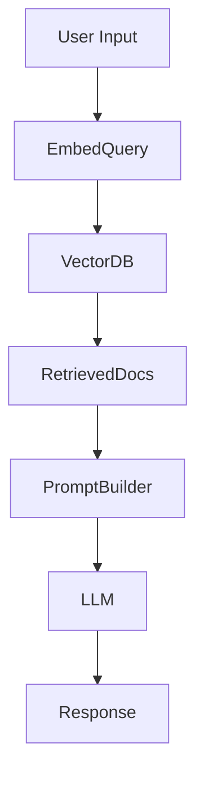

### Flow Diagram

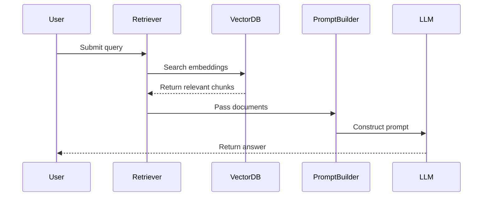

---

## 🧠 2. Cached-Augmented Generation (CAG)

**Description:** Retrieve previously computed answers or summaries to speed up response time and avoid recomputation.

**Tools:** Redis, LlamaIndex, local caches  
**Use Case:** Frequently asked support questions.

### Architecture Diagram

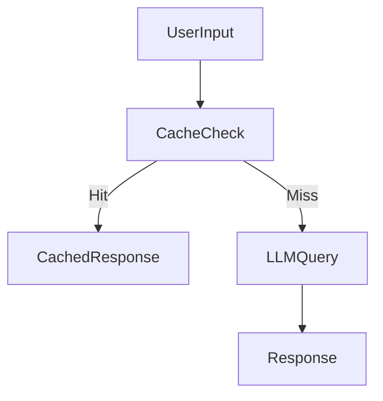

### Flow Diagram

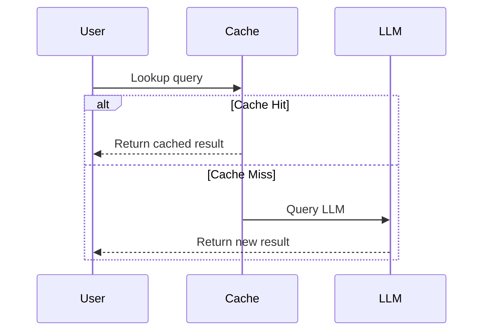

---

## 🤖 3. Tool-Augmented Pipeline

**Description:** Inject tool calls into generation flow (calculator, search, API, etc.).

**Tools:** LangChain tools, ReAct, Toolformer, OpenAI functions, Vercel AI SDK  
**Use Case:** Travel planner that looks up flights and weather.

### Architecture Diagram

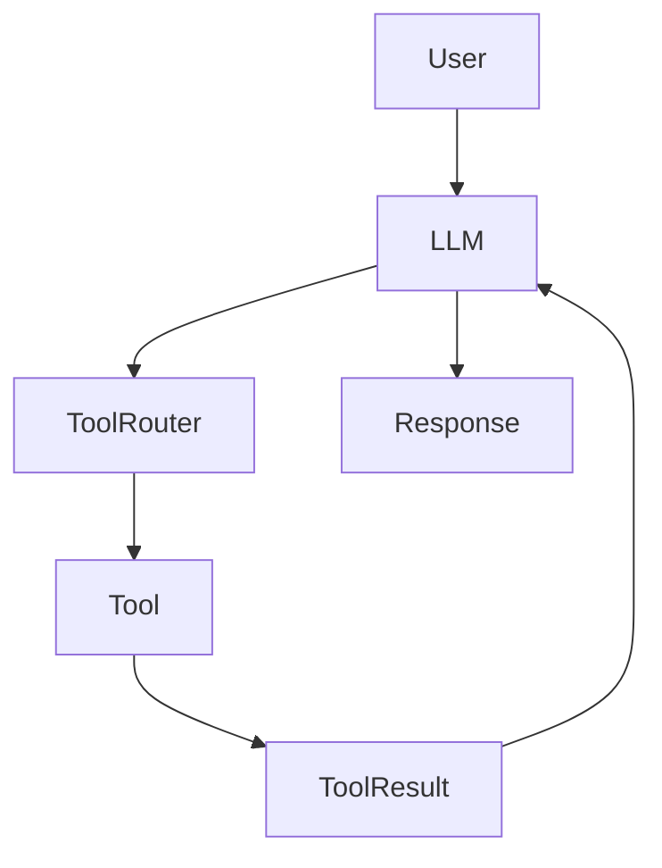

### Flow Diagram

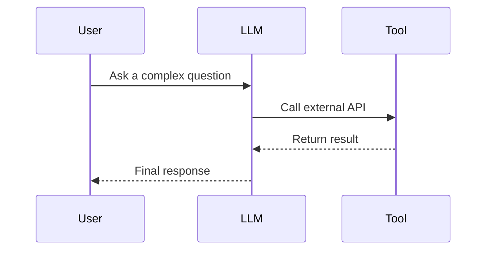

---

## 🧵 4. Memory-Augmented Pipeline

**Description:** Augments LLM with long-term or short-term memory from past interactions.

**Tools:** LangChain memory, vector DBs, semantic caching  
**Use Case:** Personal AI assistant that remembers your preferences.

### Architecture Diagram

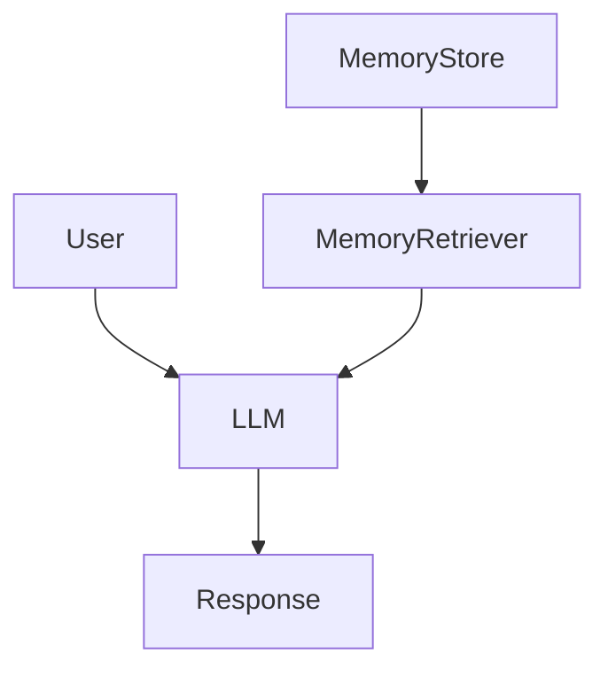

### Flow Diagram

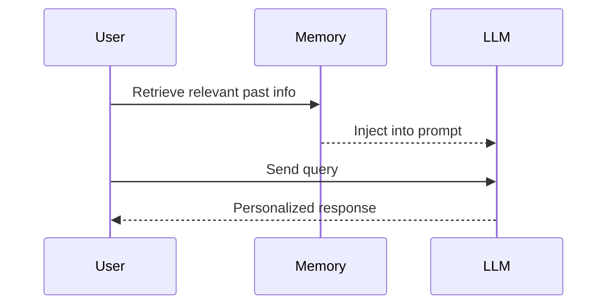

---

## 🧭 5. Agentic Pipeline

**Description:** The LLM acts as an agent that plans, acts, and reflects using tools and memory.

**Tools:** LangGraph, AutoGPT, CrewAI, LangChain agents  
**Use Case:** AI researcher that iteratively finds and summarizes papers.

### Architecture Diagram

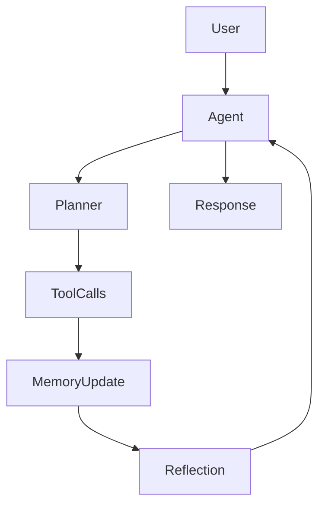

### Flow Diagram

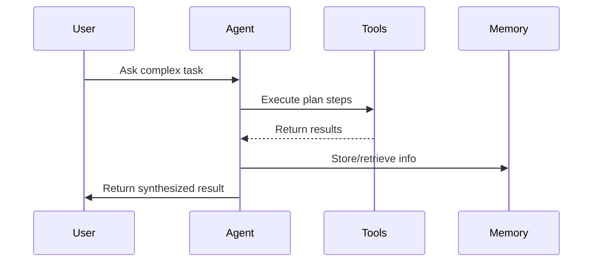

---

## 🧩 6. Programmatic Prompt Construction Pipeline

**Description:** Dynamically assembles prompts using templates, business rules, or application state.

**Tools:** LangChain, PromptLayer, DSPy, custom code  
**Use Case:** Customer support bot with form-driven answers.

### Architecture Diagram

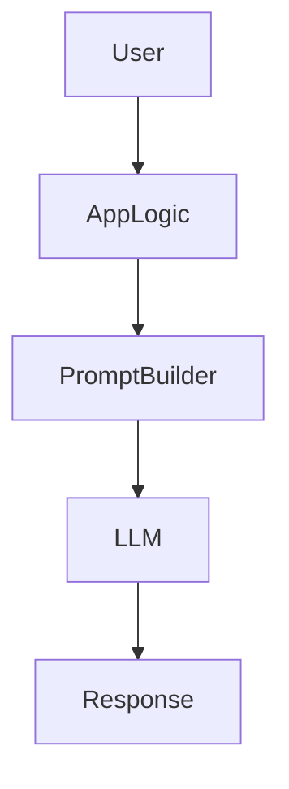

### Flow Diagram

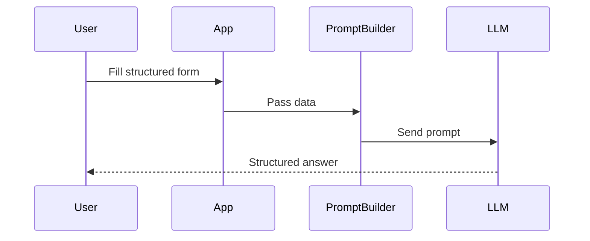

---

## 🧮 7. Schema-Linked Pipeline

**Description:** Model understands structured schema (SQL, JSON, APIs) and generates code or queries accordingly.

**Tools:** LangChain SQL agent, DSPy structured I/O, OpenAI function calling  
**Use Case:** BI assistant querying a Postgres database.

### Architecture Diagram

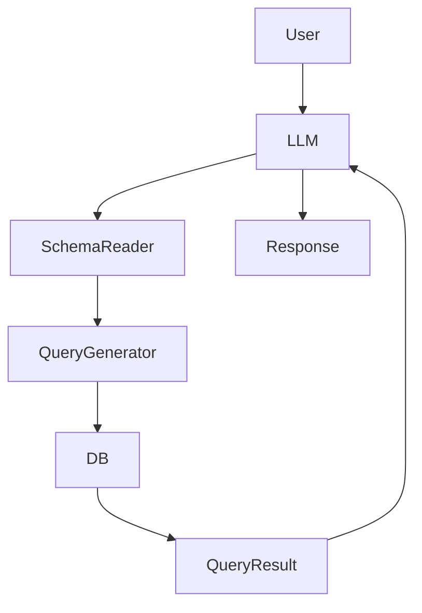

### Flow Diagram

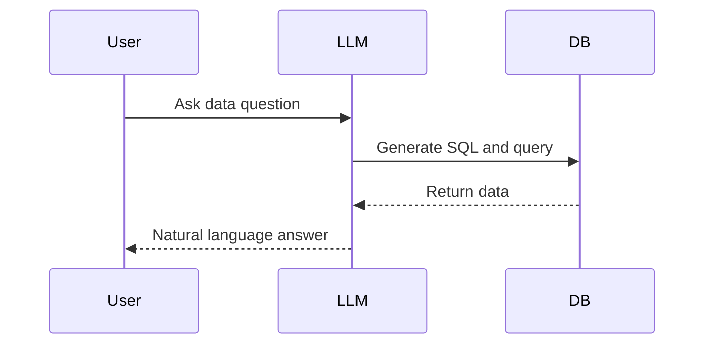

---

## 👥 10. Human-in-the-Loop Pipeline

**Description:** Incorporates human validation or intervention in the augmentation or generation process.

**Tools:** Label Studio, Trulens, Guardrails, Streamlit, Feedback APIs  
**Use Case:** Legal assistant with human review for risk-sensitive advice.

### Architecture Diagram

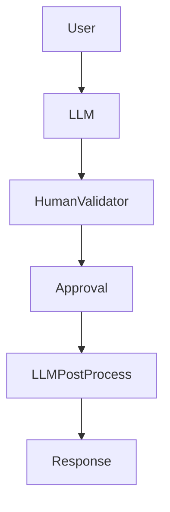

### Flow Diagram

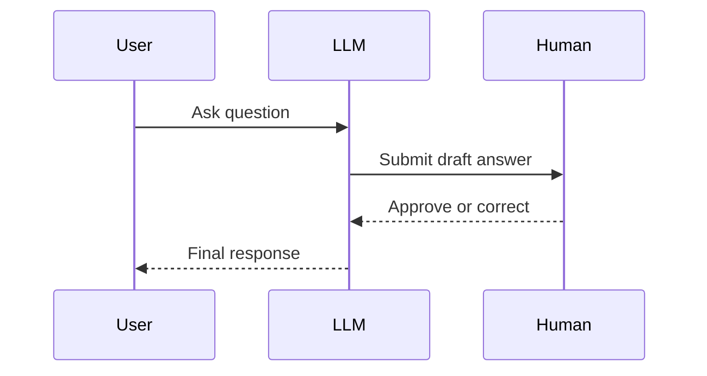

---

## 🔀 11. LangGraph State Machine Pipeline

**Description:** Uses LangGraph to orchestrate complex stateful agent workflows with branching logic and memory.

**Tools:** LangGraph, LangChain agents, LangSmith, vector stores  
**Use Case:** Multi-step task agent with retries, planning, and memory.

### Architecture Diagram

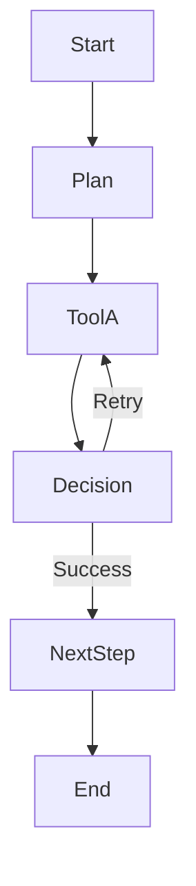

### Flow Diagram

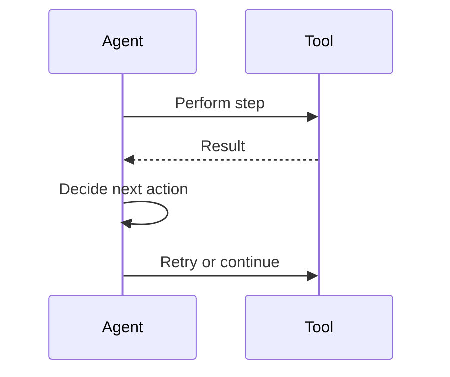

---

## 🧪 12. DSPy Compiler Pipeline

**Description:** Compiler-based approach that tunes declarative LLM programs using search, validation, and constraints.

**Tools:** DSPy, ColBERTv2, OpenAI, DeepEval  
**Use Case:** Query answering pipeline that self-improves with training data.

### Architecture Diagram

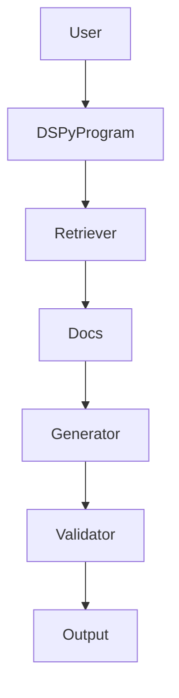

### Flow Diagram
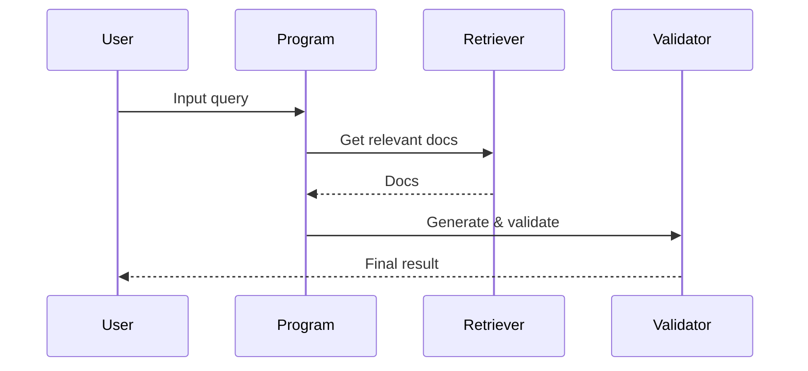

---

## 🕸️ 13. Knowledge Graph-Augmented Pipeline

**Description:** Inject facts and relationships from a knowledge graph to enhance reasoning and accuracy.

**Tools:** Neo4j, LlamaIndex KG retriever, RDF/SPARQL, LangChain  
**Use Case:** Medical assistant reasoning over symptoms and treatments.

### Architecture Diagram

```mermaid
graph TD
    User --> QueryParser
    QueryParser --> KGSearch
    KGSearch --> Facts
    Facts --> PromptBuilder
    PromptBuilder --> LLM
    LLM --> Response
```

### Flow Diagram

```mermaid
sequenceDiagram
    participant User
    participant KG
    participant LLM

    User->>KG: Query graph
    KG-->>LLM: Return facts/triples
    LLM-->>User: Answer with reasoning
```
